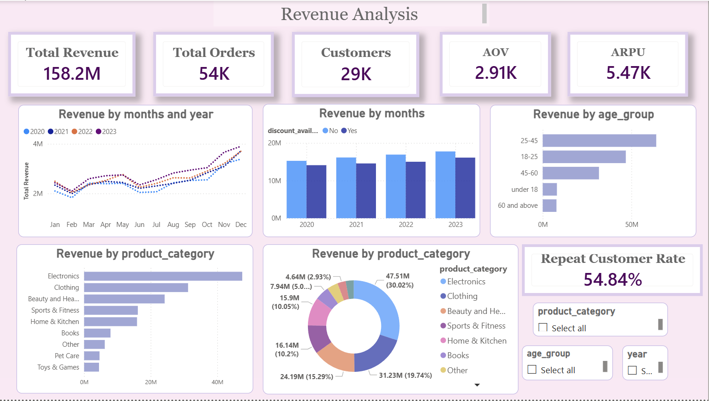
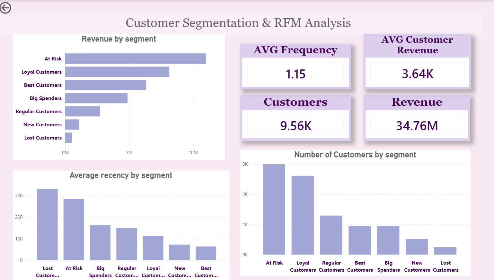

E-Commerce Customer & Revenue Analysis

Project Overview

This project focuses on analyzing e-commerce customer behavior, revenue trends, discount effectiveness, and customer segmentation using RFM analysis.

The project was completed using Python, SQL, and Power BI.

⸻

Objectives

Analyze revenue trends over time
Evaluate the effectiveness of discounts
Identify high-value customer segments
Perform RFM customer segmentation
Build interactive dashboards for business insights

⸻

Tools & Technologies

Python (Pandas, Matplotlib, Seaborn)
SQL
Power BI
Jupyter Notebook

⸻

Key Insights

Revenue Trends

Revenue demonstrated long-term growth with seasonal fluctuations.
Sales performance increased toward the end of multiple years.

Discount Analysis

Discounted orders generated slightly lower revenue across most periods.
Discounts did not create a substantial revenue uplift.

Customer Behavior

A small group of customers contributed a disproportionately large share of revenue.
Returning customers generated significant business value.

RFM Segmentation

The analysis identified:

Loyal high-value customers
Recently active customers
Low-engagement users
Potentially lost customers

⸻

Dashboard

The Power BI dashboard includes:

Revenue trends
Customer segmentation
RFM analysis
Discount impact analysis
Customer behavior insights

⸻

Repository Structure

├── data/
├── notebook/
├── powerbi/
├── images/
└── README.md

## Dashboard Preview
### Main Dashboard

### RFM Analysis

